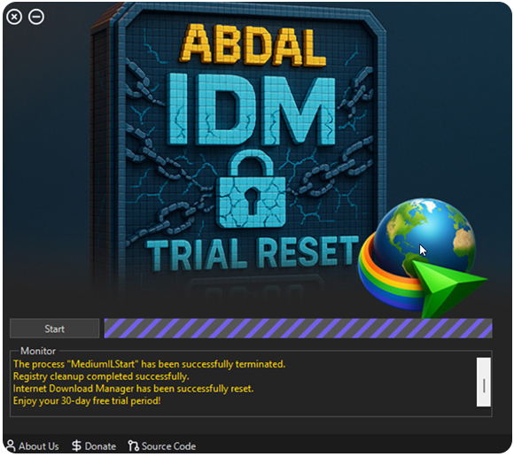

# 🔥 Abdal IDM Trial Reset

  

## 🧠 Overview
Abdal IDM Trial Reset is a fully automated utility to reset the Internet Download Manager (IDM) trial period. It is designed for users and researchers who wish to analyze software protection mechanisms and explore licensing behaviors in a legal and educational context.

## 🎙️ Translation

[English](README.md) | [فارسی](README.fa.md)

---

## 🚀 Features
- Fully automated 1-click process
- No setup or prerequisites required
- Modern and user-friendly graphical interface
- Cleans up the Windows Registry
- Offline functionality – no internet access needed

---

## 💻 How to Use
1. Launch the application.
2. Click the **Start** button.
3. Wait for the success message.
4. Open IDM and enjoy a fresh 30-day trial period.

---

## ⚠️ Disclaimer
- This tool is provided solely for educational and ethical reverse engineering analysis.
- Do not use it for commercial piracy or redistribution.
- Please respect intellectual property and software licensing rights.

## 🐛 Reporting Issues
If you encounter any issues or have configuration problems, please reach out via email at Prof.Shafiei@Gmail.com. You can also report issues on GitLab or GitHub.

## ❤️ Donation
If you find this project helpful and would like to support further development, please consider making a donation:
- [Donate Here](https://alphajet.ir/abdal-donation)

## 🤵 Programmer
Handcrafted with Passion by **Ebrahim Shafiei (EbraSha)**
- **E-Mail**: Prof.Shafiei@Gmail.com
- **Telegram**: [@ProfShafiei](https://t.me/ProfShafiei)

## 📜 License
This project is licensed under the GPLv2 or later License. 